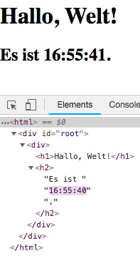

Elemente sind die kleinsten Bestandteile von React-Apps.

Ein Element beschreibt was du auf dem Bildschirm sehen möchtest:

```js
const element = <h1>Hallo, Welt</h1>;
```

Anders als die DOM Elemente eines Browser, sind React Element schlichte Objekte und günstig zu erstellen.
React DOM kümmert sich um das Aktualisieren des DOMs und den dazugehörigen React Elementen.

>**Notiz:**
>
>Man könnte Elemente mit dem allgemein bekannterem Konzept der "Komponenten" verwechseln. Komponenten werden wir
>im [nächsten Abschnitt](/docs/components-and-props.html) behandeln.
>Elemente sind das, woraus Komponenten "gemacht" werden und wir empfehlen dir ersten diesen Abschnitt zu lesen, bevor du weiter machst.

## Ein Element in das DOM rendern {#rendering-an-element-into-the-dom}

Wir nehmen mal an, wir haben ein `<div>` Element irgendwo in deiner HTML-Datei:

```html
<div id="root"></div>
```

Wir nennen es "root" DOM Knoten, da alles innerhalb dieses Elements von React DOM verwaltet wird.

Anwendungen, die mit React gebaut worden, haben normalerweise nur einen root DOM Knoten. Wenn du React in eine bestehende Anwendung einfügst, kannst du aber soviele DOM Knoten haben, wie du möchtest.

Um ein Element in den root DOM Knoten zu rendern, muss du nur beides an `ReactDOM.render()` übergeben:

`embed:rendering-elements/render-an-element.js`

[Auf CodePen ausprobieren](codepen://rendering-elements/render-an-element)

Es wird "Hallo, Welt" auf der Seite angezeigt.

## Aktualisieren des gerenderten Elements {#updating-the-rendered-element}

React Elemente sind [unveränderbar](https://en.wikipedia.org/wiki/Immutable_object). Wenn du einmal ein Element erstellt hast, kannst du dessen
Kind-Elemente oder Attribute nicht mehr verändern. Eine Element ist wie ein einzelnes Bild eines Filmes: Es repräsentiert die Benutzeroberfläche (UI) zu einem bestimmten Zeitpunkt.

Mit dem was wir bis jetzt erfahren haben, wissen wir nur, dass der einzige Weg um die Benutzeroberfläche zu Aktualisieren und neue Elemente zu erstellen, das Aufrufen von `ReactDOM.render()` ist.

Wir nehmen uns einmal dieses Beispiel einer tickenden Uhr:

`embed:rendering-elements/update-rendered-element.js`

[Auf CodePen ausprobieren](codepen://rendering-elements/update-rendered-element)

Es wird jede Sekunden wird `ReactDOM.render()` mit Hilfe einer Callback-Funktion von [`setInterval()`](https://developer.mozilla.org/en-US/docs/Web/API/WindowTimers/setInterval) aufgerufen.

>**Notiz:**
>
>In der Praxis rufen die meisten React Anwendungen `ReactDOM.render()` nur einmal auf. Im nächsten Abschnitt lernen wir, wie solch ein Code in einzelne [Zustandskomponenten](/docs/state-and-lifecycle.html) gekapselt werden.
>
>Wir empfehlen dir, Abschnitte nicht zu überspringen, da sie aufeinander aufbauen.

## React aktulisert nur das Nötigste {#react-only-updates-whats-necessary}

React DOM compares the element and its children to the previous one, and only applies the DOM updates necessary to bring the DOM to the desired state.

You can verify by inspecting the [last example](codepen://rendering-elements/update-rendered-element) with the browser tools:



Even though we create an element describing the whole UI tree on every tick, only the text node whose contents has changed gets updated by React DOM.

In our experience, thinking about how the UI should look at any given moment rather than how to change it over time eliminates a whole class of bugs.
